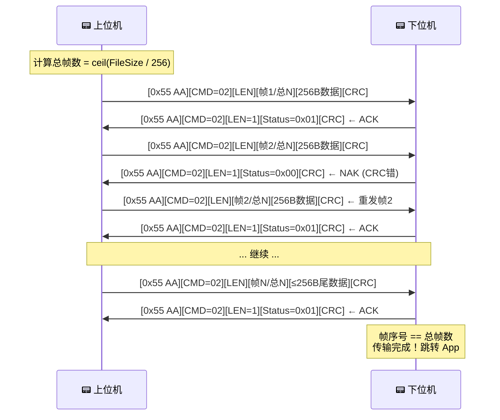

# Bootloader 通信协议升级方案

## 背景

当前协议帧结构简单（帧头 + 长度 + 数据 + CRC），应答仅为单字节 ACK/NAK。  
需要升级为包含 CMD 命令字、帧序号、总帧数的完整协议，上下位机均使用结构化帧通信。

---

## 新协议帧格式定义

### 上位机 → 下位机 (数据帧)

```
┌──────┬──────┬──────┬───────┬───────┬─────────┬─────────┬─────────┬──────────────┬───────┬───────┐
│ 0x55 │ 0xAA │ CMD  │ LEN_H │ LEN_L │ FRM_H   │ FRM_L   │ TOT_H   │ TOT_L  │ DATA[0..N-1] │ CRC_H │ CRC_L │
│ 1B   │ 1B   │ 1B   │ 1B    │ 1B    │ 1B      │ 1B      │ 1B      │ 1B     │ ≤256 B       │ 1B    │ 1B    │
└──────┴──────┴──────┴───────┴───────┴─────────┴─────────┴─────────┴────────┴──────────────┴───────┴───────┘
```

| 字段 | 字节数 | 说明 |
|------|--------|------|
| 帧头 | 2 | 固定 `0x55 0xAA` |
| CMD | 1 | 命令字，固定 `0x02` (升级数据传输) |
| Date_Len | 2 | 固件数据长度 (大端序)，仅包含 Date3~DateN 的字节数 (≤256)，**不含** Date1 和 Date2 |
| Date1 (帧序号) | 2 | 当前帧编号 (大端序)，从 1 开始递增 |
| Date2 (总帧数) | 2 | 文件被拆分后的总包数 (大端序) |
| Date3~DateN (固件数据) | ≤256 | 本帧携带的固件二进制数据 |
| CRC16 | 2 | Modbus CRC16 (大端序) |

> [!IMPORTANT]
> ### CRC 校验范围
> CRC16 的计算范围需要确认。以下提供两种方案：
> - **方案 A**：CRC 覆盖 `CMD + Date_Len + Date1 + Date2 + Date3~DateN` (从 CMD 到最后一个数据字节)
> - **方案 B**：CRC 仅覆盖 `Date3~DateN` (仅固件数据部分，与当前一致)
> 
> **本方案默认采用方案 A**（覆盖帧头后所有字段），因为这样能防止 CMD 和长度字段被篡改。请确认是否同意。

### 下位机 → 上位机 (应答帧)

```
┌──────┬──────┬──────┬───────┬───────┬─────────┬───────┬───────┐
│ 0x55 │ 0xAA │ CMD  │ LEN_H │ LEN_L │ Status  │ CRC_H │ CRC_L │
│ 1B   │ 1B   │ 1B   │ 1B    │ 1B    │ 1B      │ 1B    │ 1B    │
└──────┴──────┴──────┴───────┴───────┴─────────┴───────┴───────┘
```

| 字段 | 字节数 | 说明 |
|------|--------|------|
| 帧头 | 2 | 固定 `0x55 0xAA` |
| CMD | 1 | 固定 `0x02` |
| Date_Len | 2 | 数据域长度，固定 `0x00 0x01` (1 字节) |
| Date1 (Status) | 1 | `0x01` = ACK (继续下一帧) / `0x00` = NAK (重发上一帧) |
| CRC16 | 2 | Modbus CRC16，覆盖 `CMD + Date_Len + Date1` |

> [!IMPORTANT]
> ### 应答 Status 值确认
> 您的描述中 Date1 是"重发上一帧或继续下一帧数目"。我理解为一个状态字节：
> - `0x01` = 校验通过，请发下一帧
> - `0x00` = 校验失败，请重发上一帧
> 
> 请确认这个编码是否符合您的预期？还是您期望用其他值（比如原来的 0x06/0x15）？

---

## 新旧协议对比

| 特性 | 旧协议 | 新协议 |
|------|--------|--------|
| 命令扩展性 | 无 CMD 字段，只能做固件传输 | 有 CMD 字段，未来可扩展 |
| 帧序号 | 无，无法定位哪一包出错 | 有，可精确标识当前帧 |
| 总帧数 | 无，下位机不知道传输何时结束 | 有，下位机可判断传输完成 |
| 应答格式 | 单字节 (0x06/0x15) | 结构化帧，带 CRC 校验 |
| 传输结束判断 | 依赖超时推测 | 帧序号 == 总帧数时明确结束 |

---

## Open Questions

> [!NOTE]
> ### Q1: Date_Len 包含哪些字段？ ✅ 已确认
> `Date_Len` **仅包含** Date3~DateN (固件数据) 的长度，**不含** Date1 (帧序号) 和 Date2 (总帧数)。
> 满帧时 Date_Len = 256 (0x0100)。

> [!NOTE]
> ### Q2: 传输完成后下位机的行为？ ✅ 已确认
> 选择 **方案 A**：最后一帧 ACK 后，下位机立即自动跳转到 App (`IAP_ExecuteApp`)。

> [!NOTE]
> ### Q3: CRC 校验范围最终确认 ✅ 已确认
> 选择 **方案 A**：CRC16 覆盖从 CMD 到最后一个数据字节 (即帧头之后、CRC 之前的所有字段)。

---

## Proposed Changes

### 上位机 (projrct_up)

---

#### [MODIFY] [bsp_uart.h](file:///e:/trae/testbootloader/projrct_up/HARDWARE/bsp_uart.h)

- 新增协议相关宏定义：
  ```c
  #define FRAME_HEADER_H     0x55
  #define FRAME_HEADER_L     0xAA
  #define CMD_IAP_DATA       0x02
  #define ACK_CONTINUE       0x01   // 下位机应答：继续下一帧
  #define ACK_RESEND         0x00   // 下位机应答：重发上一帧
  ```
- 新增应答帧解析相关变量声明

---

#### [MODIFY] [bsp_uart.c](file:///e:/trae/testbootloader/projrct_up/HARDWARE/bsp_uart.c)

**1. 修改 `Send_File_To_Another_STM32()` 函数**

主要变更：
- 发送前先计算总帧数 `total_frames = ceil(TotalSize / 256)`
- 每包增加 CMD (0x02)、帧序号 (2B)、总帧数 (2B) 字段
- CRC 计算范围改为 CMD + Date_Len + Date1 + Date2 + Data
- 帧序号从 1 递增到 total_frames

新帧组装逻辑伪代码：
```c
// 帧头
send(0x55, 0xAA);
// CMD
send(0x02);
// Date_Len = payload_len (仅固件数据长度，不含帧序号和总帧数)
send(date_len_h, date_len_l);
// Date1 = 当前帧号
send(frame_num_h, frame_num_l);
// Date2 = 总帧数
send(total_frames_h, total_frames_l);
// Date3~DateN = 固件数据
send(payload_data, payload_len);
// CRC16 (覆盖 CMD ~ DateN)
send(crc_h, crc_l);
```

**2. 修改 `USART2_IRQHandler()` — 应答帧解析**

当前：单字节判断 (0x06 / 0x15)  
修改为：使用简易状态机解析下位机的结构化应答帧

- 解析帧头 0x55 0xAA → CMD → Date_Len → Status → CRC
- 校验 CRC 后根据 Status 设置 `IAP_Ack_Flag`
- 由于应答帧固定 8 字节且在中断中解析，需要用 static 变量维护状态

---

#### [MODIFY] [main.c](file:///e:/trae/testbootloader/projrct_up/HARDWARE/main.c)

- 无重大改动，`Send_File_To_Another_STM32` 的调用方式不变

---

### 下位机 (projrct_down)

---

#### [MODIFY] [bootloader.h](file:///e:/trae/testbootloader/projrct_down/HARDWARE/bootloader.h)

- 新增协议相关宏定义 (与上位机一致)
- 新增应答帧发送函数声明：
  ```c
  void Bootloader_SendResponse(uint8_t status);
  ```

---

#### [MODIFY] [bootloader.c](file:///e:/trae/testbootloader/projrct_down/HARDWARE/bootloader.c)

**1. 修改状态机 `Bootloader_Process()`**

新增状态以解析 CMD、帧序号、总帧数：

```
STATE_SYNC1 → STATE_SYNC2 → STATE_CMD → STATE_LEN_H → STATE_LEN_L
→ STATE_FRM_H → STATE_FRM_L → STATE_TOT_H → STATE_TOT_L
→ STATE_DATA → STATE_CRC_H → STATE_CRC_L
```

状态机新增处理逻辑：
- `STATE_CMD`：校验 CMD == 0x02，否则丢弃
- `STATE_FRM_H/L`：提取当前帧序号
- `STATE_TOT_H/L`：提取总帧数
- `STATE_CRC_L`：CRC 校验后发送结构化应答帧（不再是单字节）
- 最后一帧 (帧序号 == 总帧数) 写入 Flash 后自动跳转 App

**2. 新增 `Bootloader_SendResponse()` 函数**

组装并发送结构化应答帧：
```c
void Bootloader_SendResponse(uint8_t status) {
    // [0x55][0xAA][0x02][0x00][0x01][status][CRC_H][CRC_L]
    uint8_t resp[8];
    resp[0] = 0x55; resp[1] = 0xAA;
    resp[2] = 0x02;             // CMD
    resp[3] = 0x00; resp[4] = 0x01; // Date_Len = 1
    resp[5] = status;           // 0x01=ACK, 0x00=NAK
    uint16_t crc = CRC16_Calculate(&resp[2], 4); // CRC覆盖 CMD+LEN+Status
    resp[6] = crc >> 8;
    resp[7] = crc & 0xFF;
    UART_SendArray(USART1, resp, 8);
}
```

---

#### [MODIFY] [bsp_uart.c](file:///e:/trae/testbootloader/projrct_down/HARDWARE/bsp_uart.c)

- 新增 `UART_SendArray()` 函数（当前下位机只有 `UART_SendByte`，需要增加数组发送）

---

## 完整交互时序图 (新协议)



---

## 需要修改的文件清单

| 项目 | 文件 | 改动量 | 说明 |
|------|------|--------|------|
| 上位机 | `bsp_uart.h` | 小 | 新增宏定义 |
| 上位机 | `bsp_uart.c` | **大** | 重写发送函数 + 应答解析 |
| 上位机 | `main.c` | 无 | 调用方式不变 |
| 下位机 | `bootloader.h` | 小 | 新增宏定义 + 函数声明 |
| 下位机 | `bootloader.c` | **大** | 重写状态机 + 新增应答函数 |
| 下位机 | `bsp_uart.c` | 小 | 新增 UART_SendArray |
| 下位机 | `bsp_uart.h` | 小 | 新增函数声明 |
| 下位机 | `ring_buffer.*` | 无 | 不变 |

---

## Verification Plan

### 编译验证
- 上下位机分别使用 Keil 编译，确保无编译错误/警告

### 功能验证
- 使用串口调试助手手动发送构造好的数据帧，观察下位机是否正确解析并回复应答帧
- 验证 CRC 错误时下位机回复 NAK，上位机重发
- 验证帧序号 == 总帧数时下位机执行 App 跳转
