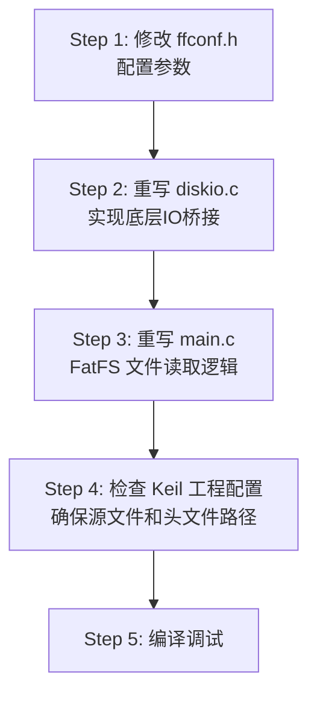

# FatFS R0.15 移植方案 — STM32F103 SD卡例程 ✅ 已完成实施

## 一、现有工程分析

### 项目结构
```
sd2/
├── CORE/                    # Cortex-M3 启动文件
├── HARDWARE/
│   ├── FATFS/               # FatFS R0.15 源码（已存在，但未适配）
│   │   ├── ff.c / ff.h      # FatFS 核心（R0.15, Revision 80286）
│   │   ├── ffconf.h         # 配置文件（未修改，默认值）
│   │   ├── diskio.c / .h    # 底层磁盘IO（★ 骨架代码，未实现）
│   │   ├── ffsystem.c       # OS 相关函数（标准模板）
│   │   └── ffunicode.c      # Unicode 支持
│   ├── SD/                  # SD卡底层SPI驱动（已实现）
│   │   ├── MMC_SD.C         # SD_Initialize, SD_ReadDisk, SD_WriteDisk 等
│   │   └── mmc_sd.h
│   ├── SPI/                 # SPI1 硬件驱动（已实现）
│   └── LCD/ LED/ KEY/       # 外设驱动
├── MALLOC/                  # 自定义内存管理 (mymalloc/myfree)
├── SYSTEM/                  # delay, sys, usart
└── USER/
    └── main.c               # 当前只做裸扇区读取
```

### 当前状况

| 模块 | 状态 | 说明 |
|------|------|------|
| SPI 驱动 | ✅ 已完成 | SPI1, PA5/6/7, 工作正常 |
| SD 卡驱动 | ✅ 已完成 | `SD_Initialize`, `SD_ReadDisk`, `SD_WriteDisk`, `SD_GetSectorCount` |
| FatFS 源码 | ⚠️ 已放入但未适配 | ff.c/ff.h 是 R0.15 原版 |
| diskio.c | ❌ 未实现 | 仍是官方骨架代码，调用不存在的 `RAM_disk_xxx` 等函数 |
| ffconf.h | ⚠️ 需要修改 | LFN关闭、CodePage=932、FF_FS_NORTC=0 等需要调整 |
| main.c | ❌ 需要改写 | 当前只读裸扇区，需改为 FatFS 文件操作 |

---

## 二、需要修改的文件清单

> [!IMPORTANT]
> 核心修改只需 **3个文件**，不需要修改 `ff.c`、`ff.h`、`ffunicode.c` 等 FatFS 源码文件。

| 序号 | 文件 | 修改类型 | 修改内容概述 |
|------|------|----------|-------------|
| 1 | `HARDWARE/FATFS/diskio.c` | **重写** | 实现底层磁盘IO，桥接 SD 卡驱动 |
| 2 | `HARDWARE/FATFS/ffconf.h` | **修改** | 配置 FatFS 参数适配 STM32 + SD卡 |
| 3 | `USER/main.c` | **重写** | 添加 FatFS 文件读取逻辑 |

---

## 三、详细修改方案

### 文件1：`diskio.c` — 底层磁盘IO适配（核心）

这是移植的**关键文件**，需要将 FatFS 的磁盘操作接口桥接到已有的 SD 卡驱动。

#### 需要实现的5个函数：

```c
#include "ff.h"
#include "diskio.h"
#include "MMC_SD.h"   // 引入SD卡驱动

#define SD_CARD  0     // 只有一个驱动器：SD卡，编号为0
```

| 函数 | 作用说明 | 实现逻辑 |
|------|---------|--------|
| `disk_status(pdrv)` | **查询驱动器状态**。FatFs 在挂载和每次操作前调用此函数，检查驱动器是否已初始化、有无介质、是否写保护 | 检查 `SD_Type` 全局变量，若非0则返回 `0`（正常），否则返回 `STA_NOINIT` |
| `disk_initialize(pdrv)` | **初始化磁盘硬件**。FatFs 在 `f_mount()` 挂载时，若驱动器尚未初始化则调用此函数，完成 SPI 配置和 SD 卡识别 | 调用 `SD_Initialize()` 完成卡类型检测，返回0则成功，否则 `STA_NOINIT` |
| `disk_read(pdrv, buff, sector, count)` | **读取扇区数据**。FatFs 在 `f_read()` 等文件读操作时调用，从 SD 卡读取指定数量的 512 字节扇区到缓冲区 | 调用 `SD_ReadDisk(buff, sector, count)` 通过 SPI 读取，返回0则 `RES_OK` |
| `disk_write(pdrv, buff, sector, count)` | **写入扇区数据**。FatFs 在 `f_write()`、`f_sync()` 等文件写操作时调用，将缓冲区数据写入 SD 卡指定扇区 | 调用 `SD_WriteDisk(buff, sector, count)` 通过 SPI 写入，返回0则 `RES_OK` |
| `disk_ioctl(pdrv, cmd, buff)` | **杂项磁盘控制**。FatFs 在格式化、获取剩余空间、关闭文件等场景调用，执行同步刷新、查询容量等控制操作 | 处理 `CTRL_SYNC`（刷新写缓冲）、`GET_SECTOR_COUNT`（返回总扇区数）、`GET_SECTOR_SIZE`（返回512）、`GET_BLOCK_SIZE`（返回擦除块大小8） |

> [!NOTE]
> `SD_ReadDisk` 的 `cnt` 参数是 `u8` 类型（最大255扇区），而 FatFS 的 `count` 是 `UINT` 类型。
> 需注意：如果一次读取超过255扇区，需要分批调用。但通常 FatFS 不会一次请求这么多，可以直接强转。

#### `disk_ioctl` 实现细节：

```c
DRESULT disk_ioctl(BYTE pdrv, BYTE cmd, void *buff)
{
    if (pdrv != SD_CARD) return RES_PARERR;
    
    switch (cmd) {
    case CTRL_SYNC:
        // SD卡SPI模式下，等待SD卡就绪即可
        if (SD_Select() == 0) { SD_DisSelect(); return RES_OK; }
        return RES_ERROR;
    case GET_SECTOR_COUNT:
        *(DWORD*)buff = SD_GetSectorCount();
        return RES_OK;
    case GET_SECTOR_SIZE:
        *(WORD*)buff = 512;
        return RES_OK;
    case GET_BLOCK_SIZE:
        *(DWORD*)buff = 8; // 块擦除大小（扇区数），SD卡通常8
        return RES_OK;
    }
    return RES_PARERR;
}
```

---

### 文件2：`ffconf.h` — 配置修改

| 宏定义 | 原值 | 修改为 | 原因 |
|--------|------|--------|------|
| `FF_CODE_PAGE` | `932` (日文) | `936` | 支持简体中文文件名（如果不需要中文可设为 `437` 美国英语，节省ROM） |
| `FF_USE_LFN` | `0` (关闭) | `1` 或 `2` | 启用长文件名支持；`1`=BSS静态缓冲；`2`=栈上动态缓冲 |
| `FF_FS_NORTC` | `0` | `1` | STM32F103无RTC或不使用RTC，关闭时间戳避免需要实现 `get_fattime()` |
| `FF_VOLUMES` | `1` | `1` | 保持1个卷（只有SD卡） |

> [!TIP]
> - 如果不需要中文文件名，将 `FF_CODE_PAGE` 改为 `437`，可以节省大量 ROM（ffunicode.c 中的码表很大）
> - `FF_USE_LFN` 建议设为 `1`（BSS静态），STM32F103 内存有限，避免栈溢出
> - 如果文件名全是8.3短名（如 `TEST.BIN`），也可以保持 `FF_USE_LFN=0`

---

### 文件3：`main.c` — 文件读取逻辑

#### 主要改动：

1. 添加 `#include "ff.h"` 头文件
2. 定义全局 `FATFS` 和 `FIL` 对象
3. 使用 `f_mount()` 挂载文件系统
4. 使用 `f_open()` + `f_read()` + `f_close()` 读取文件

#### 核心代码流程：

```c
#include "ff.h"   // FatFS 头文件

FATFS fs;         // 文件系统对象
FIL   fil;        // 文件对象
FRESULT res;      // 操作结果
UINT br;          // 实际读取字节数

int main(void)
{
    u8 read_buf[512];
    
    // ... 硬件初始化（同原来）...
    
    // 1. 挂载文件系统
    res = f_mount(&fs, "0:", 1);  // 挂载驱动器0，立即挂载
    if (res != FR_OK) {
        printf("f_mount error: %d\r\n", res);
        while(1);
    }
    
    // 2. 打开文件
    res = f_open(&fil, "0:test.bin", FA_READ);
    if (res != FR_OK) {
        printf("f_open error: %d\r\n", res);
        while(1);
    }
    
    // 3. 读取文件内容
    printf("File size: %lu bytes\r\n", f_size(&fil));
    
    while (1) {
        res = f_read(&fil, read_buf, sizeof(read_buf), &br);
        if (res != FR_OK || br == 0) break;  // 读取出错或到文件末尾
        
        // 处理读取到的数据（br 字节）
        for (UINT i = 0; i < br; i++) {
            printf("%02X ", read_buf[i]);
        }
    }
    
    // 4. 关闭文件
    f_close(&fil);
    printf("\r\nFile read complete!\r\n");
    
    while(1) { /* ... */ }
}
```

---

## 四、额外注意事项

### 1. `get_fattime()` 函数

> [!WARNING]
> 如果 `FF_FS_NORTC` 保持为 `0`，则需要实现 `get_fattime()` 函数，否则**编译会报链接错误**。

建议方案：将 `FF_FS_NORTC` 设为 `1`，避免需要实现此函数。如果确实需要写文件带时间戳，可以返回固定时间：

```c
DWORD get_fattime(void)
{
    return ((DWORD)(2026 - 1980) << 25) | ((DWORD)5 << 21) | ((DWORD)8 << 16) |
           ((DWORD)12 << 11) | ((DWORD)0 << 5) | ((DWORD)0 >> 1);
}
```

### 2. Keil 工程配置

确保以下文件已添加到 Keil 工程的源文件列表中：
- `HARDWARE/FATFS/ff.c`
- `HARDWARE/FATFS/diskio.c`
- `HARDWARE/FATFS/ffsystem.c`
- `HARDWARE/FATFS/ffunicode.c`

头文件包含路径需包含：
- `HARDWARE/FATFS`
- `HARDWARE/SD`

### 3. 内存占用估算

| 资源 | 大小 | 说明 |
|------|------|------|
| `FATFS` 结构体 | ~560 字节 | 文件系统工作区 |
| `FIL` 结构体 | ~560 字节 | 每个打开的文件 |
| `read_buf` | 512 字节 | 读取缓冲区 |
| `ff.c` 代码 | ~8-12 KB | FatFS 核心代码 |
| `ffunicode.c` | 较大 | 取决于 `FF_CODE_PAGE`（437约1KB，936约170KB） |

> [!CAUTION]
> STM32F103C8T6 只有 **64KB Flash + 20KB RAM**。如果使用 `FF_CODE_PAGE=936`（中文），ffunicode.c 编译后可能超出 Flash 容量。
> 建议：如果文件名只用英文，设 `FF_CODE_PAGE=437`，大幅减小体积。

### 4. SD 卡格式要求

- SD卡必须格式化为 **FAT16** 或 **FAT32** 文件系统
- `test.bin` 文件必须放在 SD 卡根目录下

---

## 五、修改优先级和实施顺序



---

准备好后，我可以立即帮你实施这3个文件的修改。
